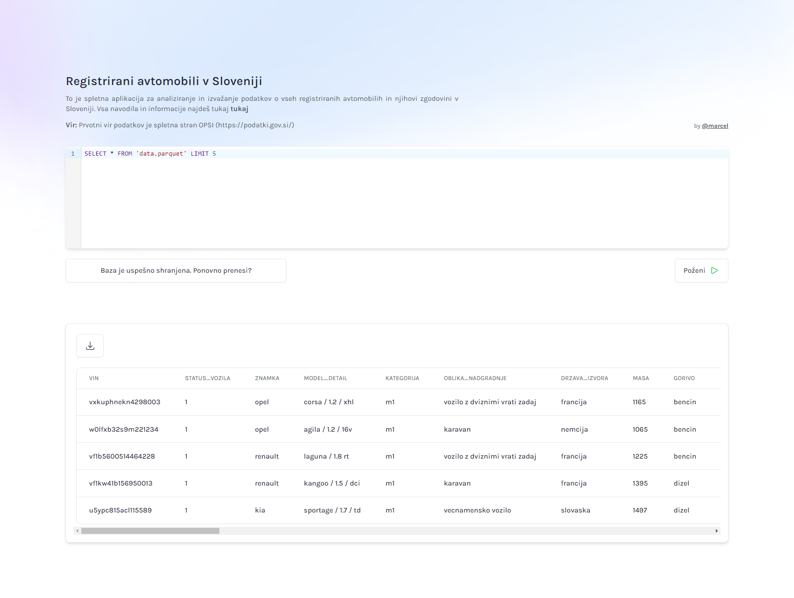

# Registrirani avtomobili v Sloveniji 🚗

## Opis

To je spletna aplikacija za analiziranje in izvažanje podatkov o vseh registriranih avtomobilih in njihovi zgodovini.

Povezava: https://vozila-slo-app.netlify.app/



V primeru, da aplikacijo uporabljaš prvič, moraš najprej prenesti vse podatke. To narediš s klikom na gumb "Prenesi celotno bazo". V mojem primeru prenos traja ~1min. Baza se shrani v brskalnik, tako, da jo ob naslednji uporabi ni potrebno ponovno prenašati (če želiš bazo zbrisati glej spodaj \*). Baza se prenese iz [tukaj](https://www.dropbox.com/scl/fo/op2kgmsnzzjyjcwwaqxwt/h?rlkey=9z463algspgjlu3va1fkw1fir&dl=0). Celotna skripta, ki je bila uporabljena za pripravo podatkov je dostopna v mapi [data_prep_notebooks](data_prep_notebooks/). Trenutno sta v bazi samo kategoriji M1 in M1G (to so osebni avtomobili) od leta 2016 do 2022. Podatki za celotno leto 2023 še niso objavljeni.

Če je bil avtomobil v evidenci registriranih vozil v vseh letih od 2016 do 2022, bo v bazi zabeležen 7x, za vsako leto enkrat. Leto zapisa je ponazorjeno s stolpcem "leto_zapisa".

Za poizvedovanje po bazi se uporablja SQL. Primer je prikazan spodaj.

Prvotni vir podatkov je spletna stran [OPSI](https://podatki.gov.si/)

#### Primer SQL poizvedbe

Ta poizvedba izpiše vse električne avtomobile znamke Volkswagen v letu 2022.

```sql
SELECT * FROM 'data.parquet'
WHERE leto_zapisa = 2022 AND gorivo = 'ni goriva' AND znamka = 'volkswagen';
```

Ta pa izpiše število e-golfov v posameznih letih

```sql
SELECT leto_zapisa, COUNT(*) AS stevilo FROM 'data.parquet'
WHERE model_simple = 'e-golf'
GROUP BY leto_zapisa
ORDER BY leto_zapisa DESC;
```

## Zakaj?

Več o tem, zakaj sem tole naredil, sem napisal [tukaj](https://medium.com/@marcel.lah/podatki-o-registriranih-vozilih-v-sloveniji-b8651bcf7f19).

#### \* Kako zbrisati podatke iz brskalnika?

[Na kratko je napisano tukaj](https://www.howtogeek.com/664912/how-to-clear-storage-and-site-data-for-a-single-site-on-google-chrome/)
